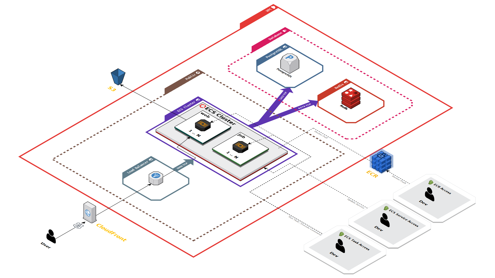

# Infrastructure as Code (IaC) for Mech Cool

This subfolder manages the infrastructure for our web application. We use the [CDK for Terraform](https://developer.hashicorp.com/terraform/cdktf) (`CDKTF`) with Typescript to define and provision our infrastructure components on AWS. The Terraform `Runs`, `States`, and `Variables` are managed securely using [Terraform Cloud](https://app.terraform.io).

## Prerequisites

- Install [Terraform](https://www.terraform.io/downloads).
- Install [CDKTF CLI](https://developer.hashicorp.com/terraform/tutorials/cdktf/cdktf-install#install-cdktf).
- Have an AWS account with necessary permissions.
- Have a [Terraform Cloud](https://app.terraform.io) account.

## Architecture Overview

Our web application is deployed on AWS and utilizes the following services:

- **Cloudfront**: Content delivery.
- **Application Load Balancer**: Directs web traffic.
- **ECR**: Docker container registry.
- **ECS**: Container orchestration service.
- **Postgres**: Relational database service.
- **Redis**: In-memory data structure store.
- **S3**: Storage of static assets.

The following diagram shows the architecture of our web application:



## Credentials Setup

1. Change directory into `infra` directory.
2. Add `mech-cool` profile to `~/.aws/credentials` file.
3. Insert your AWS access key ID and secret access key.
4. Paste your [Terraform Cloud API Token](https://app.terraform.io/app/settings/tokens) into `terraform-cloud-token` file.
5. Login to Terraform Cloud using `cat terraform-cloud-token | cdktf login`.

## Infra Deployment

1. Change directory into `infra` directory.
2. Run `cdktf get` to get the necessary CDKTF provider packages.
3. To see planned changes without applying, use `cdktf diff web-app-production`.
4. Run `cdktf deploy web-app-production` to provision the resources.

## App Deployment

```
aws ecr get-login-password --profile mech-cool | docker login --username AWS --password-stdin 375381314102.dkr.ecr.us-east-1.amazonaws.com
docker build --platform=linux/amd64 --build-arg ENV=production -t 375381314102.dkr.ecr.us-east-1.amazonaws.com/mech-cool/web-app-production:manual -t 375381314102.dkr.ecr.us-east-1.amazonaws.com/mech-cool/web-app-production:release .
docker push --all-tags 375381314102.dkr.ecr.us-east-1.amazonaws.com/mech-cool/web-app-production
aws ecs update-service --profile mech-cool --cluster web-app-production --service web --force-new-deployment &> /dev/null
aws ecs update-service --profile mech-cool --cluster web-app-production --service job --force-new-deployment &> /dev/null
```

## Continuous Deployment

TODO

## Security

TODO

## Testing

TODO

## Troubleshooting

TODO

## Miscellaneous

Run a one-off task on ECS:  
(This spins up a new container and runs the command)

```sh
./run-task --task-definition web-app-production-web --cluster web-app-production --file ./run-task.json
```

Run a command on ECS:  
(This runs the command on an existing container)

```sh
./execute-command --cluster web-app-production bash
```

Run the production assets container locally:  
(Useful for testing Dockerfile changes)

```sh
docker buildx build --target assets --platform=linux/amd64 --build-arg ENV=production -t mech-cool/web-app-production-assets .
docker run --rm -it --platform=linux/amd64 -e DOCKER_BUILD=true mech-cool/web-app-production-assets:latest bash
```

Run the production app container locally:  
(Useful for testing Dockerfile changes)

```sh
docker run --rm -it --platform=linux/amd64 -e DOCKER_BUILD=true mech-cool/web-app-production:latest bash
```

To remove troublesome state:  
(Useful for when reality and state are out of sync)

```sh
cd infra/cdktf.out/stacks/web-app-production
terraform state rm '<id>'
```
